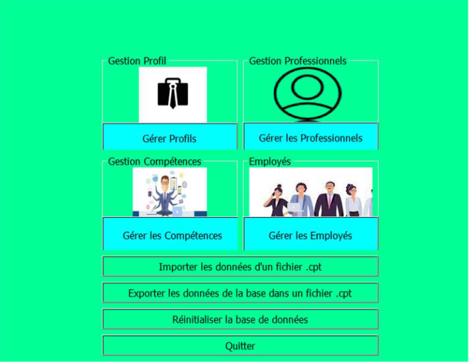

# Gestion-de-Competences-en-C---avec-Qt---Projet-Graphique
Ce dépôt GitHub contient un projet C++ de gestion de compétences en mode graphique réalisé avec Qt. L'application permet de gérer les compétences d'une équipe en utilisant une base de données fournie en format .db.
Il s'agit d'une application qt graphique de gestion de compétences. La version évolutive de la version console proposée précédemment 

## Images

Voici le manuel d'utilisation pour compiler et utiliser l'application :
## Compilation sous Qt

Pour compiler le projet, suivez les étapes ci-dessous :

1. **Dézipper le dossier**: Téléchargez et décompressez le dossier du projet sur votre ordinateur.

2. **Exécuter Qt Creator**: Assurez-vous que vous avez Qt Creator installé sur votre système. Sinon, téléchargez et installez Qt Creator à partir du site officiel.

3. **Ouvrir le fichier Projet.pro**: Lancez Qt Creator et sélectionnez "Ouvrir un projet". Naviguez jusqu'au dossier "Source" du dossier du projet décompressé et ouvrez le fichier Projet.pro.

4. **Compiler**: Une fois le projet ouvert, faites un clic droit sur le dossier du tp sous Qt et cliquez sur "Exécuter" ou cliquez sur la flèche verte dans la barre latérale pour compiler le projet.

5. **Manuel d'utilisation**: Après avoir compilé avec succès, consultez le manuel d'utilisation ci-dessous pour comprendre comment utiliser l'application.

## Manuel d'utilisation

Pour utiliser l'application, suivez les étapes ci-dessous :

1. **Authentification**: Lorsque vous lancez l'application, entrez votre nom d'utilisateur et votre mot de passe. Seules les personnes autorisées peuvent accéder à l'application.

   - Nom d'utilisateur par défaut: root
   - Mot de passe par défaut: root

2. **Menu**: Une fois connecté, vous verrez le menu principal. Le menu offre plusieurs possibilités de gestion des compétences :

   - Gestion des profils
   - Gestion des compétences
   - Gestion des professionnels
   - Gestion des utilisateurs
   - Importation des données à partir d'un fichier .cpt (fichier exemple fourni)
   - Exportation de la base de données dans un fichier .cpt
   - Réinitialisation de la base de données

3. **Instructions**: Suivez les instructions du menu pour effectuer les différentes actions de gestion des compétences. L'application est conçue pour être très facile d'utilisation.

## Mode console du projet
- **GitHub**: [Lien vers le dépôt GitHub de la version console](https://github.com/AsKing07/Gestion-de-competence-C---Console)

## Remarque

Ce projet est réalisé avec Qt et sert à des fins éducatives. Il met en œuvre la gestion de compétences en mode graphique. Toute contribution et amélioration sont les bienvenues.

## Contact

- **GitHub**: [Lien vers le dépôt GitHub](https://github.com/AsKing07/Gestion-de-Competences-en-C-avec-Qt---Projet-Graphique)

---

*Veuillez noter que ce README fournit des instructions pour compiler et utiliser l'application. Pour accéder au code source complet, veuillez consulter le dépôt GitHub indiqué dans la section "Contact".*
